# 3Legent E-Commerce Platform
**3legent** is a full-stack e-commerce application built with **Next.js** on the frontend, **FastAPI** on the backend, **Firebase** as the database, and **Redux** for state management. Following an MVC-inspired structure, it delivers a clean separation of concerns across the app.


## 🚀 Technologies
- **Frontend**: Next.js, Redux, Tailwind CSS
- **Backend**: FastAPI (Python)
- **Database**: Firebase (Firestore, Authentication)
- **State Management**: Redux Toolkit

## 📦 Features
- User authentication (Login/Register)
- Product catalog & search
- Shopping cart & checkout
- Order history
- Responsive design

## 📂 Project Structure
```
3legent/
├── frontend/ # Next.js application
│ ├── app/   
│ ├── components/
│ ├── store/
│ ├── public/
│ └── styles/
│
├── backend/ # FastAPI application
│ ├── controllers/
│ ├── models/
│ ├── routes/
│ ├── services/
| ├── config/
│ └── main.py
│
└── README.md
```
## 🛠️ Installation

### Frontend
```bash
cd frontend
npm install
npm run dev
```
### Backend

```bash
cd backend
python -m venv venv
source venv/bin/activate  # Linux/Mac
venv\Scripts\activate     # Windows
pip install -r requirements.txt
uvicorn main:app --reload

```

## 🔧 Configuration
```bash
Create .env file in /frontend:
NEXT_PUBLIC_FIREBASE_API_KEY=your_key
NEXT_PUBLIC_FIREBASE_AUTH_DOMAIN=your_domain
NEXT_PUBLIC_FIREBASE_PROJECT_ID=your_id
```
## 📸 Screenshots

### Home Page
| Desktop | Mobile |
|---------|--------|
|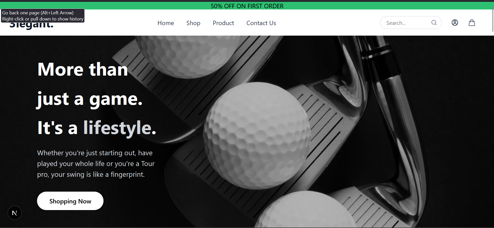 | 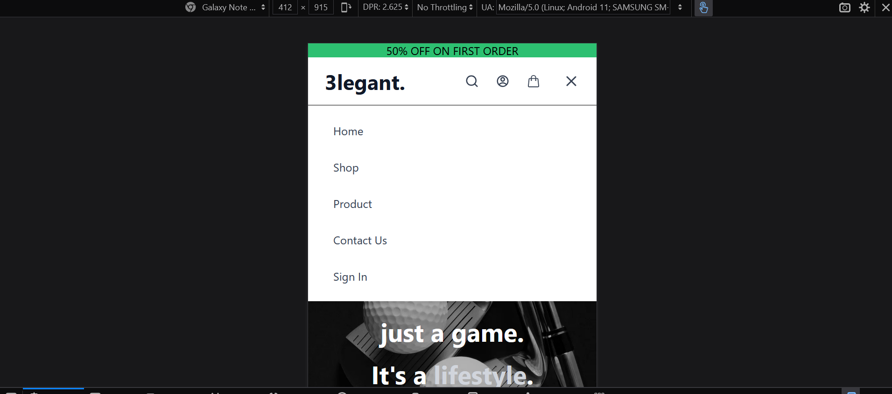 |
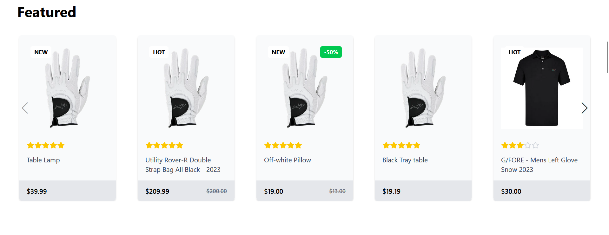
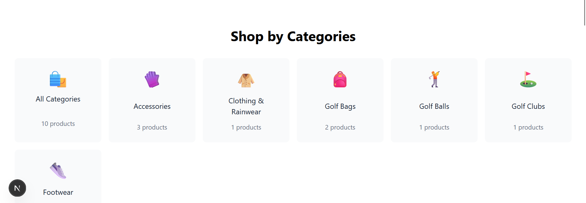

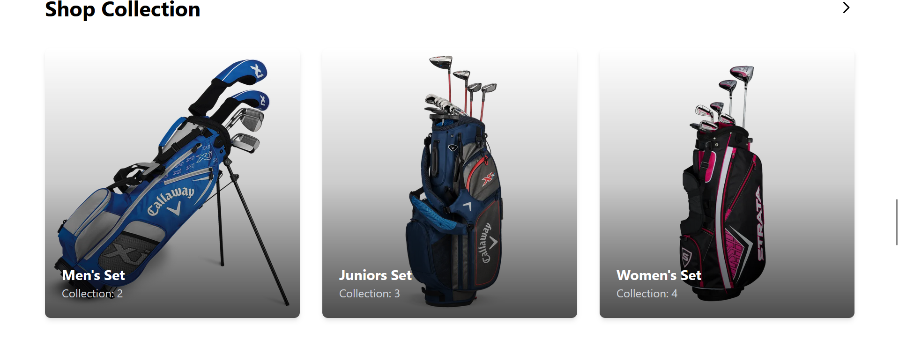

### Authentication
| Login Page | Signup Page |
|------------|-------------|
| 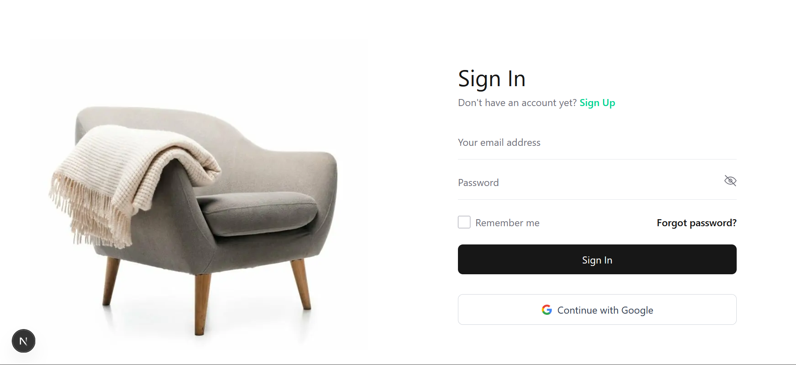 | 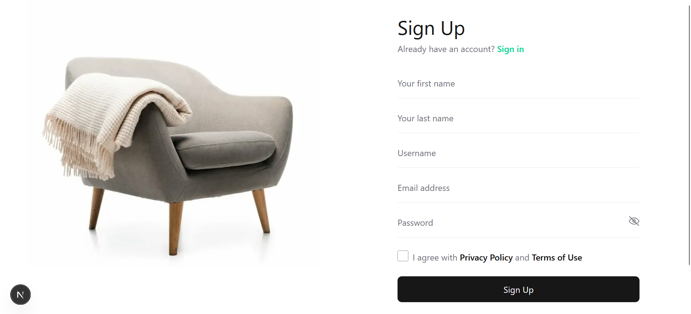 |

### Shopping Experience
| Desktop View | Mobile View |
|-----------|-----------------|
| 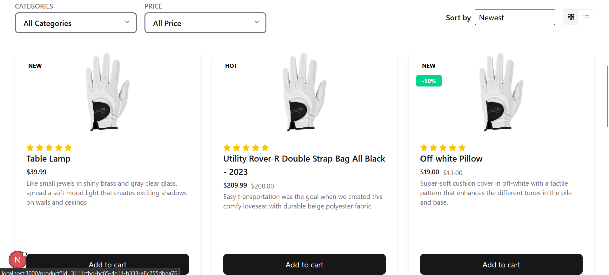 | 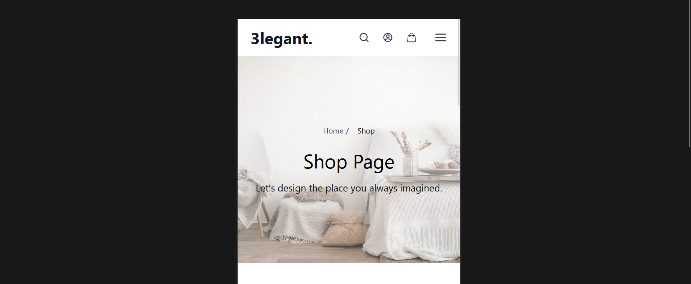 |
| 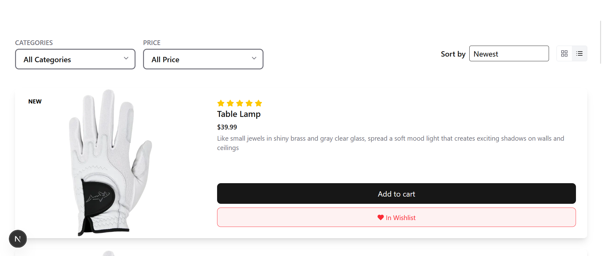 |  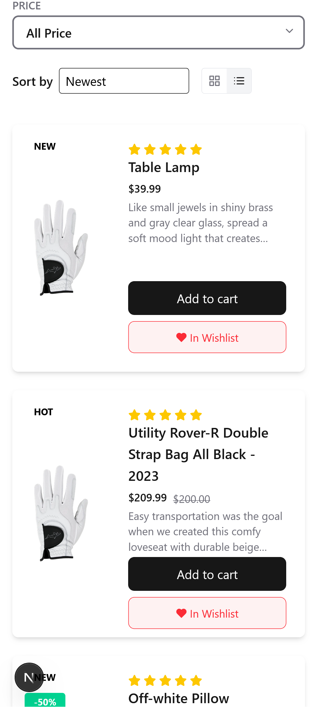


### User Account
| My Account | Wishlist |
|------------|----------|
| 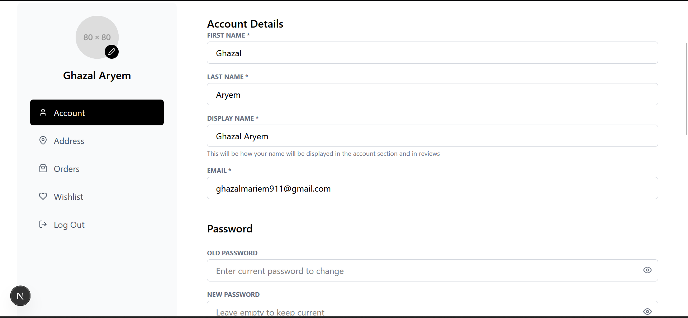 | 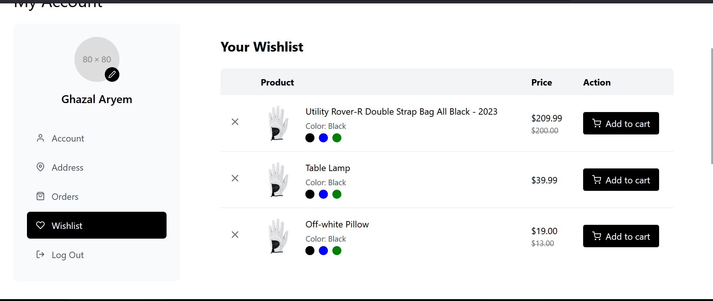 |

### Checkout Process
### Cart	
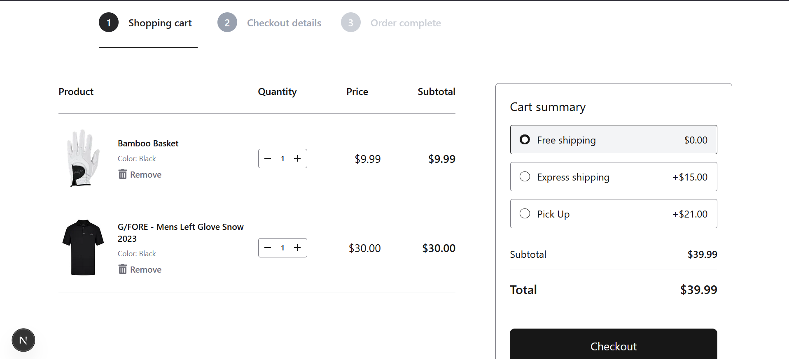
### checkout
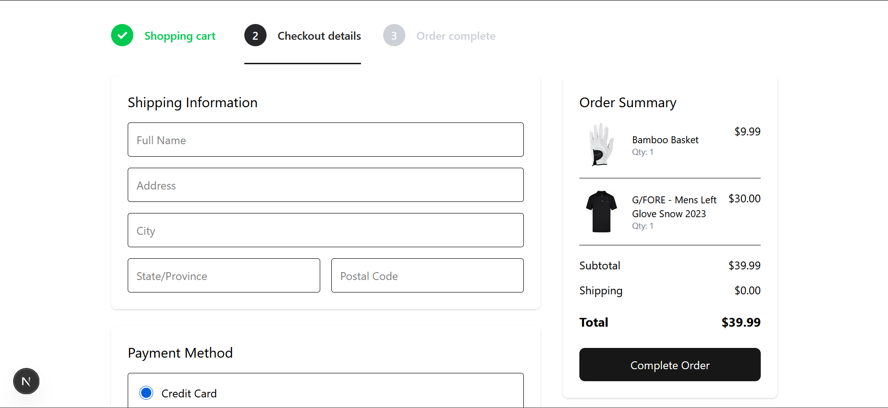
### order Complete
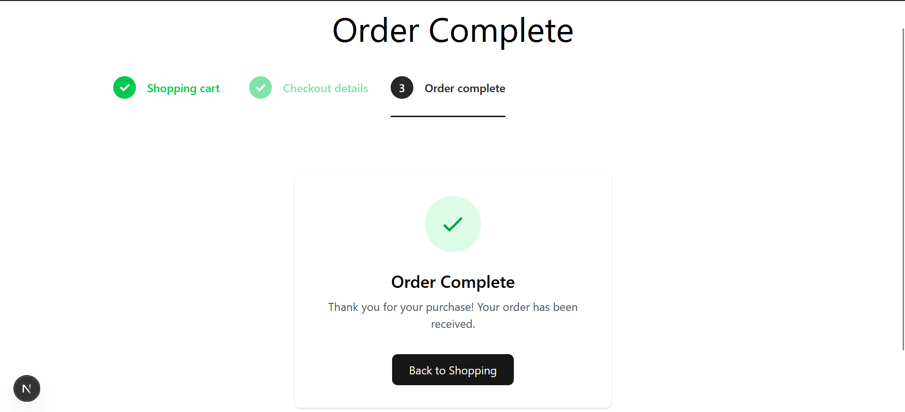

# 📜 License
Distributed under the MIT License.

# 📬 Contact
**Ghazal Aryem** — _Creator & Maintainer_  

- [GitHub Profile](https://github.com/Ghazal-Aryem)  
- [LinkedIn](https://www.linkedin.com/in/ghazal-aryem-203a03255)  


# 3Legent E-Commerce Platform
**3legent** is a full-stack e-commerce application built with **Next.js** on the frontend, **FastAPI** on the backend, **Firebase** as the database, and **Redux** for state management. Following an MVC-inspired structure, it delivers a clean separation of concerns across the app.


## 🚀 Technologies
- **Frontend**: Next.js, Redux, Tailwind CSS
- **Backend**: FastAPI (Python)
- **Database**: Firebase (Firestore, Authentication)
- **State Management**: Redux Toolkit

## 📦 Features
- User authentication (Login/Register)
- Product catalog & search
- Shopping cart & checkout
- Order history
- Responsive design

## 📂 Project Structure
```
3legent/
├── frontend/ # Next.js application
│ ├── app/   
│ ├── components/
│ ├── store/
│ ├── public/
│ └── styles/
│
├── backend/ # FastAPI application
│ ├── controllers/
│ ├── models/
│ ├── routes/
│ ├── services/
| ├── config/
│ └── main.py
│
└── README.md
```
## 🛠️ Installation

### Frontend
```bash
cd frontend
npm install
npm run dev
```
### Backend

```bash
cd backend
python -m venv venv
source venv/bin/activate  # Linux/Mac
venv\Scripts\activate     # Windows
pip install -r requirements.txt
uvicorn main:app --reload

```

## 🔧 Configuration
```bash
Create .env file in /frontend:
NEXT_PUBLIC_FIREBASE_API_KEY=your_key
NEXT_PUBLIC_FIREBASE_AUTH_DOMAIN=your_domain
NEXT_PUBLIC_FIREBASE_PROJECT_ID=your_id
```
## 📸 Screenshots

### Home Page
| Desktop | Mobile |
|---------|--------|
| ||
||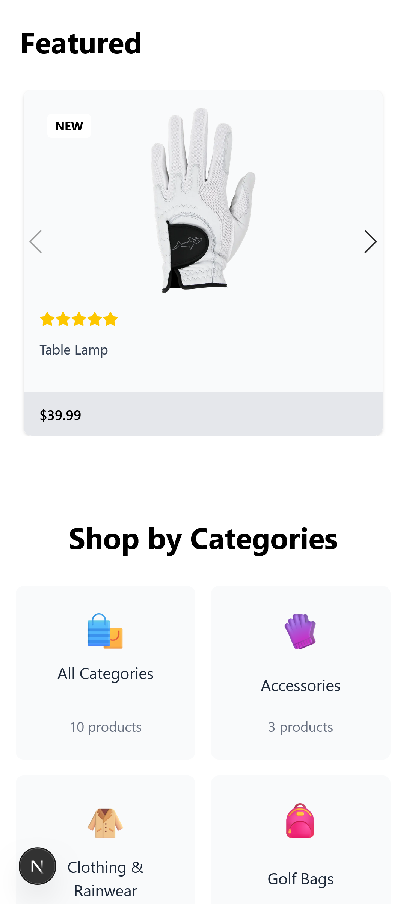|
|| 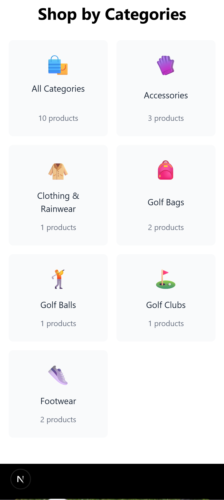|
|||
||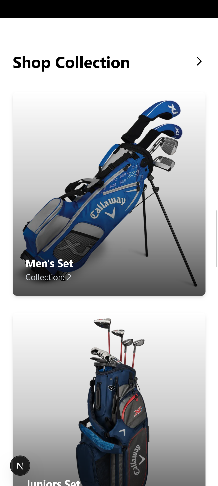|

### Authentication
| Login Page | Signup Page |
|------------|-------------|
|  |  |

### Shopping Experience
| Desktop View | Mobile View |
|-----------|-----------------|
|  |  |
|  |


### User Account
| My Account | Wishlist |
|------------|----------|
|  |  |

### Checkout Process
### Cart	

### checkout

### order Complete


# 📜 License
Distributed under the MIT License.

# 📬 Contact
**Ghazal Aryem** — _Creator & Maintainer_  

- [GitHub Profile](https://github.com/Ghazal-Aryem)  
- [LinkedIn](https://www.linkedin.com/in/ghazal-aryem-203a03255)  


